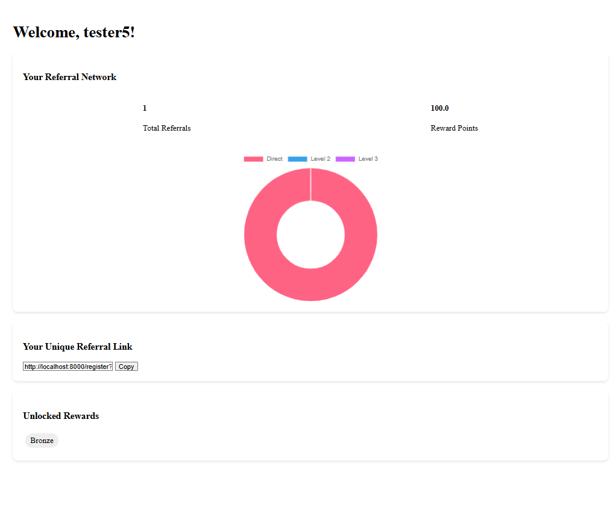
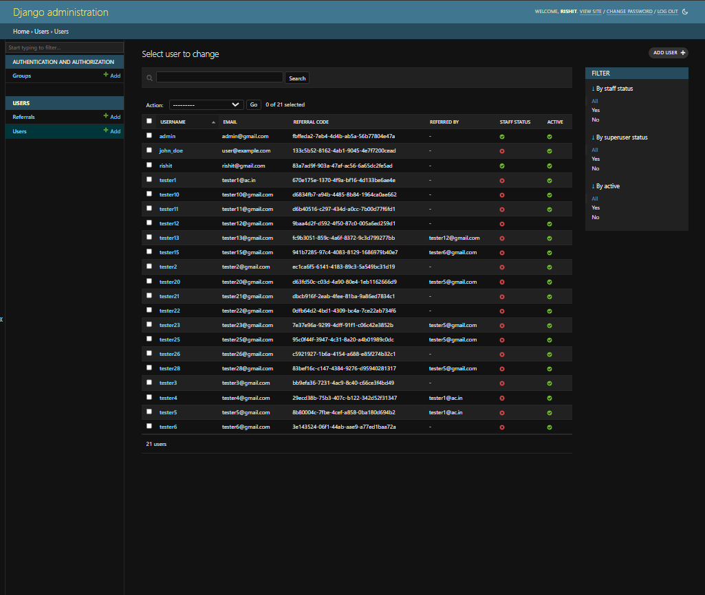
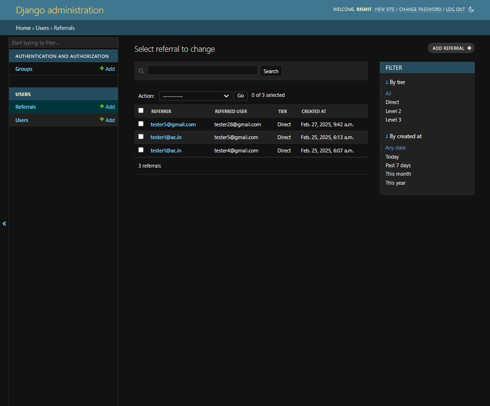

# Vomychat Intern Assignment

## Overview
This project is a Django application that implements a referral system. It allows users to register, refer new users, and track referrals across multiple tiers. Key features include:

- **Custom User Model** with a unique referral code.
- **Automated Referral Network** using Django signals.
- **JWT Authentication** using Django REST Framework SimpleJWT with tokens stored in cookies.
- **User Dashboard** displaying referral statistics, a unique referral link, rewards, and referral charts.
- **Containerized Deployment** using Docker and Docker Compose.

## Features
- **User Registration and Login:**  
  Users can register and log in. The registration page optionally accepts a referral code. If the referral code is provided via the URL, it is automatically applied and the field is hidden.
  
- **Referral Network:**  
  When a user registers with a referral code, referral entries are automatically created for up to three tiers:
  - **Tier 1 (Direct)**
  - **Tier 2** (if the referrer was referred by someone)
  - **Tier 3** (if applicable)
  
- **Rewards Calculation:**  
  Rewards are calculated based on the number and tier of referrals, and users earn points and badges.
  
- **Dashboard:**  
  A dashboard view shows:
  - Total referrals.
  - Reward points.
  - A doughnut chart displaying referral distribution.
  - A unique referral link for inviting others.

- **Admin Panel:**  
  The Django admin panel is used to manage users, referrals, and rewards.

## Installation

### 1. Clone the Repository
```bash
git clone https://github.com/yourusername/project-repo.git
cd project-repo
```

### 2. Build Docker Containers
```bash
docker-compose build --no-cache
```

### 3. Run Docker Containers
```bash
docker-compose up
```

### 4. Apply Migrations
```bash
docker-compose exec web python manage.py migrate
```

### 5. Create a Superuser
```bash
docker-compose exec web python manage.py createsuperuser
```

## File Structure
- **backend/**:  
  Contains project settings, URL configurations, and the WSGI application.
  
- **users/**:  
  Contains the Django app for user management and referral logic:
  - **models.py**: Defines `CustomUser`, `Referral`, `Reward`, etc.
  - **views.py**: Implements `registration_view` and `dashboard_view`.
  - **forms.py**: Contains the registration form.
  - **signals.py**: Contains post-save signals for automatic referral creation.
  - **apps.py**: Configures the app and loads signals on startup.
  - **admin.py**: Admin configuration for managing users and referrals.
  - **utils.py**: Utility functions for rewards calculation.

## Usage

### Registration
- **With a Referral Code via URL:**  
  If a user visits:
  
  `http://localhost:8000/register?referral=8b80004c-7fbe-4cef-a858-0ba180d694b2`
  
  the referral code is automatically applied, and the referral field is hidden.

- **Without a Referral Code:**  
  Users can manually enter a referral code on the registration form.

### Dashboard
After successful registration and login, users are redirected to the dashboard at `http://localhost:8000/dashboard` where they can view:
- Their total number of referrals.
- Reward points and unlocked badges.
- A visual chart (doughnut chart) of referral tiers.
- A unique referral link.

### Admin Panel
Access the Django admin panel at `http://localhost:8000/admin` to manage users, referrals, and rewards.

## Screenshots

### Dashboard


### Admin Panel - Users


### Admin Panel - Referrals


## Deployment
This project is containerized using Docker. For production deployment:
- Set necessary environment variables (e.g., `SECRET_KEY`, `DEBUG`, `DATABASE_URL`).
- Use the provided `docker-compose.yml` file to build and run containers.
- Gunicorn is used as the WSGI server in production.

## Additional Information

### Referral Creation Logic
Referral entries are created via a Django post-save signal on the `CustomUser` model. To ensure the signal creates referrals correctly, the `referred_by` field must be set **before** the user is saved. This way, the signal fires with `created=True`, and referral entries for Tier 1, Tier 2, and Tier 3 are automatically generated.

### JWT Authentication
JWT tokens are generated using SimpleJWT and stored in cookies. A custom middleware processes the tokens to authenticate users.

### Rewards Calculation
Rewards are computed based on referral tiers and are cached for improved performance. The dashboard displays the calculated points and any badges the user has unlocked.

Thank You for the opportunity
